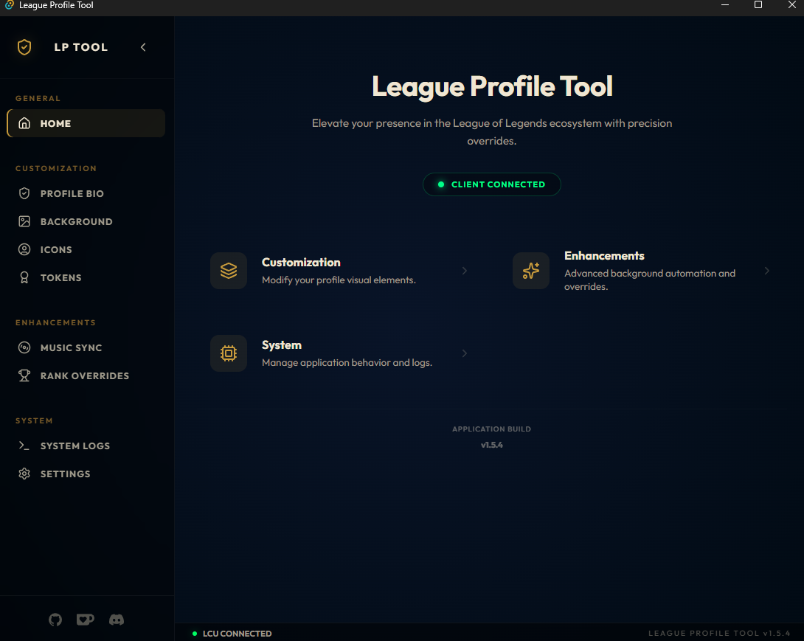

# 🏆 League Profile Tool

A desktop tool built with **Tauri v2** and **React** for League of Legends profile customization through the LCU (League Client Update) API.

<p align="center">

<a href="https://github.com/L9Lenny/league_profile_tool/releases">
  
</a>

<a href="https://github.com/L9Lenny/league_profile_tool/actions">
  
</a>

<a href="https://github.com/L9Lenny/league_profile_tool/actions/workflows/virustotal-report.yml">
  
</a>

<a href="https://sonarcloud.io/summary/new_code?id=L9Lenny_league_profile_tool">
  
</a>


[](https://github.com/L9Lenny/league_profile_tool/releases)  


<a href="LICENSE">
  
</a>

</p>

---



<p align="center">
  <a href="https://www.youtube.com/watch?v=zd6FKj8uvA4">
    <strong>🎥 Click here to watch the full video demo</strong>
    <br>
    
  </a>
</p>

> **Tip:** Fast links: [Download](https://github.com/L9Lenny/league_profile_tool/releases) • [Security Report](res/docs/SECURITY_REPORT.md) • [Changelog](res/docs/CHANGELOG.md)

| 🚀 Start Here | 🔗 Link |
|---|---|
| Latest Release | [GitHub Releases](https://github.com/L9Lenny/league_profile_tool/releases) |
| CI Workflows | [GitHub Actions](https://github.com/L9Lenny/league_profile_tool/actions) |
| Security Report | [`res/docs/SECURITY_REPORT.md`](res/docs/SECURITY_REPORT.md) |

## ✨ Main Features

- **🗂️ Categorized Navigation**: Premium vertical sidebar with grouped categories (Customization, Enhancements, System).
- **🧹 Smart Friend Manager**: Bulk delete friends with ease, featuring real-time Riot ID display (Name#Tag) and a detailed progress tracker.
- **🏠 Live Profile Dashboard**: Redesigned home page with a live header displaying your current summoner icon, level, and Riot ID.
- **🖼️ Profile Background**: Dedicated tab to set any champion skin as your profile background with lazy loading.
- **🆕 Profile Tokens**: Customize your 3 challenge medals with a visual image picker powered by HD Community Dragon assets.
- **🎵 Music Integration**: Synchronize your profile bio with your **Last.fm** scrobbles automatically.
- **🏆 Rank Mirror**: Customize your visible **Solo/Duo rank** with live draft previews and holographic grids.
- **🖼️ Icon Swapper**: Browse and apply **6,000+ profile icons** with descriptive names (e.g., "Blue Minion Bruiser").
- **📝 Presence Control**: Edit **bio/chat status** and set LCU presence (**Online, Away, Mobile, Offline**).
- **⚡ Performance Optimized**: Version-aware local cache for metadata and JPG previews for instant loading.
- **🔄 Auto-Updater**: Built-in update detection with secure ED25519 signatures.
- **↔️ Collapsible Sidebar**: Support for icon-only mode with smooth transitions.

## ⚡ Quick Start (Users)

1. Download the latest build from [Releases](https://github.com/L9Lenny/league_profile_tool/releases).
2. Start League of Legends client.
3. Open **League Profile Tool**.
4. Join our [Discord Server](https://discord.gg/G3M4X3B) (Optional) for support and updates.
5. Apply your desired customizations directly through the Hextech-inspired UI.

## 🛠️ Development

### Prerequisites

- **Node.js**: `v20.x` or newer
- **Rust**: latest stable via [rustup](https://rustup.rs/)
- **League of Legends** client installed

### Run locally

```bash
git clone https://github.com/L9Lenny/league_profile_tool.git
cd league_profile_tool
npm ci
npm run tauri dev
```

### Production build

```bash
npm run tauri build
```

## 🔒 Security and Trust

This project uses automated checks and public reporting:

- **CodeQL** for static security analysis
- **SonarCloud** for quality and hotspot analysis
- **Dependabot** for dependency updates
- **VirusTotal release report** generated in CI and published at [`res/docs/SECURITY_REPORT.md`](res/docs/SECURITY_REPORT.md)

All checks run in GitHub Actions and are publicly visible from the repository Actions tab.

<details>
<summary><strong>🧪 How release verification works (CLICK HERE)</strong></summary>

1. CI builds release artifacts.
2. Release assets are scanned via VirusTotal.
3. Results are published to `res/docs/SECURITY_REPORT.md`.
4. Users can cross-check release notes, hashes/signatures, and scan report.

</details>

## 🧰 Built With

- [Tauri v2](https://v2.tauri.app/)
- [React](https://react.dev/)
- [Lucide React](https://lucide.dev/)
- [Vite](https://vitejs.dev/)

## 📚 Project Docs

- [Changelog](res/docs/CHANGELOG.md)
- [Contributing](res/docs/CONTRIBUTING.md)
- [Code of Conduct](res/docs/CODE_OF_CONDUCT.md)
- [Security Policy](res/docs/SECURITY.md)

## 📄 License

This project is licensed under the [MIT License](LICENSE).

## ☕ Support

If the project is useful to you, you can support it here:

[](https://ko-fi.com/profumato)

## 👥 Contributors

<!-- ALL-CONTRIBUTORS-LIST:START - Do not remove or modify this section -->
<!-- prettier-ignore-start -->
<!-- markdownlint-disable -->
<table>
  <tbody>
    <tr>
      <td align="center" valign="top" width="14.28%"><a href="https://github.com/L9Lenny"><br /><sub><b>L9Lenny</b></sub></a><br /><a href="https://github.com/L9Lenny/league_profile_tool/commits?author=L9Lenny" title="Code">💻</a> <a href="#design-L9Lenny" title="Design">🎨</a> <a href="#maintenance-L9Lenny" title="Maintenance">🚧</a></td>
    </tr>
  </tbody>
</table>

<!-- markdownlint-restore -->
<!-- prettier-ignore-end -->

<!-- ALL-CONTRIBUTORS-LIST:END -->

This project follows the [all-contributors](https://github.com/all-contributors/all-contributors) specification.

---

*Disclaimer: This tool is not affiliated with, endorsed by, or integrated with Riot Games in any official capacity.*
